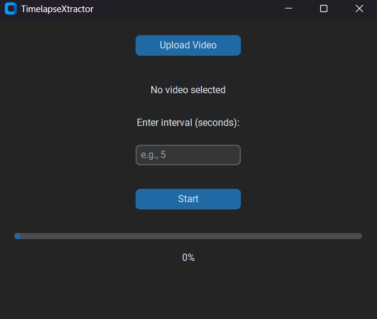

# TimelapseXtractor:

>A tool designed to generate timestamped videos by capturing frames at regular intervals specified in seconds. This allows users to create a time-lapse effect or extract key moments from a video, offering a simple yet powerful way to summarize or highlight content over time.



### Installation
1. Clone this repository:
   ```bash
   git clone https://github.com/dhia619/TimelapseXtractor
   ```
2. Install dependencies:
    ```bash
    pip install -r requirements.txt
    ```

### Usage
```bash
python main.py
```
1. upload a video
2. choose an interval of seconds
3. click on start